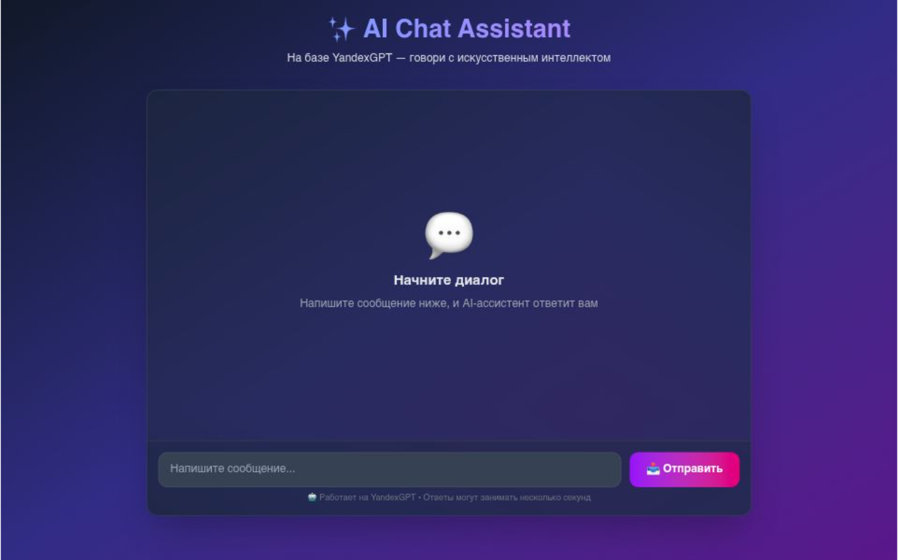

# ✨ AI Chat Assistant




Современный AI-чат на базе **YandexGPT** с красивым интерфейсом, поддержкой **Markdown** и сохранением истории. Работает полностью в России, без VPN и иностранных карт.

---

## 🚀 Возможности

- ✅ **YandexGPT API** — официальный российский AI, грант 4000 ₽
- ✅ **Markdown** — списки, заголовки, код, ссылки
- ✅ **Сохранение истории** — диалог не исчезает после перезагрузки
- ✅ **Современный UI** — градиенты, анимации, аватарки
- ✅ **Адаптивный дизайн** — работает на телефонах и планшетах
- ✅ **Автоскролл** — новые сообщения всегда в поле видимости

---

## 🛠️ Технологии


| Технология                                                   | Назначение |
| ------------------------------------------------------------ | ---------- |
| [Next.js 15](https://nextjs.org/)                            | Фреймворк  |
| [TypeScript](https://www.typescriptlang.org/)                | Типизация  |
| [Tailwind CSS](https://tailwindcss.com/)                     | Стили      |
| [React Markdown](https://github.com/remarkjs/react-markdown) | Markdown   |
| [YandexGPT API](https://cloud.yandex.ru/services/yandexgpt)  | AI         |
| [Vercel](https://vercel.com/)                                | Деплой     |


---

## 📦 Установка и запуск

### 1. Клонируй репозиторий

```bash
git clone https://github.com/etherea1ly/yandexgpt_chat.git
cd yandexgpt_chat
```

### 2. Установи зависимости

```bash
npm install
```

### 3. Получи API-ключ YandexGPT

1. Зарегистрируйся в [Yandex Cloud](https://cloud.yandex.ru/)
2. Создай сервисный аккаунт с ролью `ai.languageModels.user`
3. Создай API-ключ (выбери scope `yc.ai.languageModels.execute`)
4. Скопируй Folder ID из каталога

### 4. Настрой переменные окружения

Создай файл .env.local

```env
YANDEX_API_KEY=AQVN...твой_ключ
YANDEX_FOLDER_ID=b1g...твой_folder_id
```

### 5. Запусти проект

```bash
npm run dev
```

Открой [http://localhost:3000](http://localhost:3000)

---

## 🌐 Деплой на Vercel

1. Залей код на GitHub
2. Зайди на vercel.com
3. Импортируй репозиторий
4. Добавь переменные окружения (YANDEX_API_KEY, YANDEX_FOLDER_ID)
5. Нажми Deploy

---

## 📁 Структура проекта

```text
├── app/
│   ├── api/chat/yandex/
│   │   └── route.ts      # API-маршрут для YandexGPT
│   ├── globals.css       # Глобальные стили + Markdown
│   ├── layout.tsx        # Корневой layout
│   └── page.tsx          # Главный компонент чата
├── public/               # Статика
├── .env.local            # Переменные окружения (не в Git)
├── package.json
├── tsconfig.json
└── README.md
```

---

## 🤝 Как внести вклад

1. Форкни проект
2. Создай ветку (git checkout -b feature/AmazingFeature)
3. Закоммить изменения (git commit -m 'Add some AmazingFeature')
4. Запушь (git push origin feature/AmazingFeature)
5. Открой Pull Request

---

## 📝 Лицензия

MIT — свободно для использования и модификации.

---

🙏 Благодарности

- [Yandex Cloud](https://cloud.yandex.ru/) за грант 4000 ₽
- [Vercel](https://vercel.com/) за бесплатный хостинг
- Сообществу Next.js и Tailwind CSS

---

### Разработано с ❤️ для вайбкодинга

